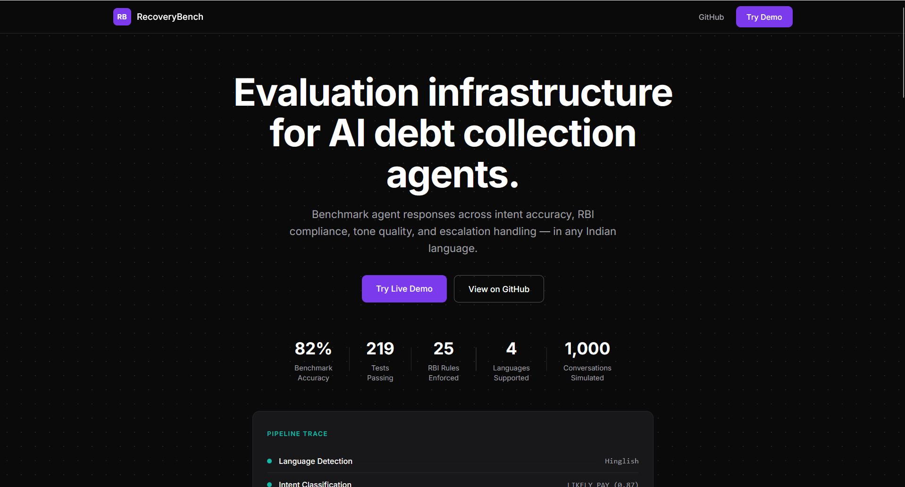
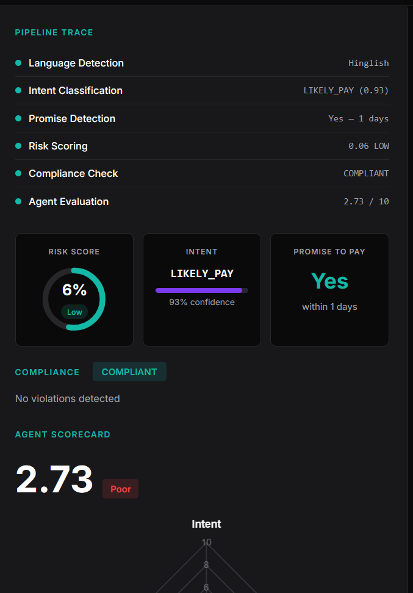
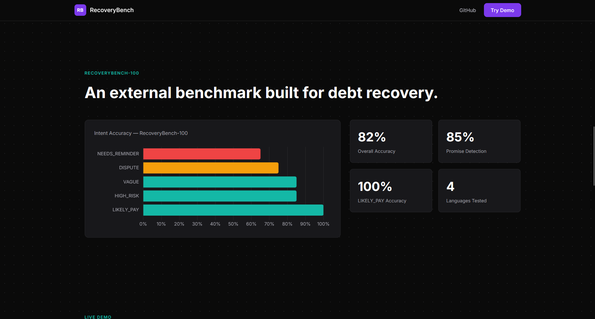
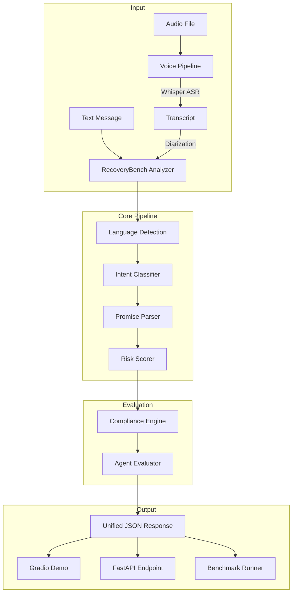

# RecoveryBench

### Multilingual AI Debt Collection Agent Evaluation Platform

[](https://www.python.org/downloads/)
[](LICENSE)
[](#-test-suite)
[](#-docker-deployment)

**Evaluate, benchmark, and improve AI agents that handle debt collection conversations — in English, Hindi, Bengali, and Hinglish.**

[Quick Start](#-quick-start) · [Architecture](#-architecture) · [Benchmarks](#-benchmark-results) · [API](#-api-reference) · [Dataset](#-dataset-card)

</div>

---

## What Is RecoveryBench?

RecoveryBench is a six-stage evaluation pipeline for AI agents operating in debt collection workflows. It takes a borrower message (text or audio) and an agent response, and returns a structured assessment covering intent classification, promise detection, risk scoring, RBI compliance checking, and multi-rubric agent quality evaluation.

```json
{
  "language": "Hinglish",
  "repayment_intent": "LIKELY_PAY",
  "intent_confidence": 0.91,
  "risk_score": 0.34,
  "promise_to_pay": true,
  "payment_window_days": 7,
  "recommended_action": "follow-up after 5 days",
  "compliance": {
    "compliant": true,
    "violations": [],
    "severity": "none"
  },
  "agent_eval": {
    "intent_accuracy": 9.2,
    "tone_score": 8.7,
    "compliance_score": 10.0,
    "escalation_score": 7.5,
    "overall_score": 8.8,
    "suggested_improvement": "Acknowledge salary delay before restating EMI amount"
  }
}
```

---

## Screenshots

### Landing Page


### Live Evaluation — Text Analysis


### Benchmark Results


---

## Architecture



### Component Flow

    Input (text or audio)
    │
    ├── Language Detection
    │     └── English | Hindi | Bengali | Hinglish
    │
    ├── Intent Classification (TF-IDF + LogisticRegression)
    │     └── LIKELY_PAY | NEEDS_REMINDER | DISPUTE |
    │         HIGH_RISK | VAGUE | ALREADY_PAID
    │
    ├── Promise Extraction (multilingual rule-based parser)
    │     └── {promise_to_pay: bool, payment_window_days: int}
    │
    ├── Risk Scoring (XGBoost, 9 features)
    │     └── 0.0 (low risk) → 1.0 (critical)
    │
    ├── Compliance Check (25 RBI-grounded rules, 233 patterns)
    │     └── {compliant: bool, violations: [...], severity: str}
    │
    └── Agent Evaluation (LLM-as-judge, 4 rubrics)
          └── intent_accuracy | tone | compliance | escalation

---

## Quick Start

```bash
# 1. Clone
git clone https://github.com/YOUR_USERNAME/recoverbench.git
cd recoverbench

# 2. Install
pip install -r requirements.txt

# 3. Run a quick analysis
python -c "
from pipeline.analyzer import RecoveryBenchAnalyzer
a = RecoveryBenchAnalyzer()
result = a.analyze_text(
    'kal kar dunga payment bhai',
    'Your EMI is 15 days overdue.'
)
import json; print(json.dumps(result, indent=2))
"
```

### Start the API

```bash
uvicorn api.main:app --port 8000
# API docs at http://localhost:8000/docs
```

### Run the Gradio Demo

```bash
python demo/app.py
# Opens at http://localhost:7860
```

### Docker

```bash
docker-compose up
```

---

## Benchmark Results

### RecoveryBench-100

| Metric | Score |
|--------|-------|
| Overall Intent Accuracy | 82% |
| Promise Extraction Accuracy | 85% |
| Window Match (±3 days) | 100% |
| Avg Agent Eval Score | 7.42 / 10 |

### Per-Intent Accuracy

| Intent Class | Accuracy |
|-------------|----------|
| LIKELY_PAY | 100% |
| HIGH_RISK | 85% |
| VAGUE | 85% |
| DISPUTE | 75% |
| NEEDS_REMINDER | 65% |

### Per-Language F1 (Test Set)

| Language | Macro F1 |
|----------|----------|
| Hinglish | 0.768 |
| English | 0.749 |
| Hindi | 0.744 |
| Bengali | 0.740 |

### Test Set (601 examples)

| Class | F1 | Support |
|-------|----|---------|
| VAGUE | 0.992 | 126 |
| HIGH_RISK | 0.952 | 91 |
| NEEDS_REMINDER | 0.910 | 92 |
| LIKELY_PAY | 0.853 | 115 |
| DISPUTE | 0.789 | 85 |
| ALREADY_PAID | keyword override | 92 |

> ALREADY_PAID uses a deterministic keyword override rather than the ML classifier — the class boundary with DISPUTE is inherently ambiguous and the class was absent from training data. See [error analysis](analysis/reports/error_report.md).

---

## API Reference

| Method | Path | Description |
|--------|------|-------------|
| `GET` | `/health` | Health check |
| `GET` | `/metrics` | Uptime, request counts, component status |
| `POST` | `/analyze/text` | Analyze text conversation |
| `POST` | `/analyze/audio` | Analyze audio file (multipart) |

### Example

```bash
curl -X POST http://localhost:8000/analyze/text \
  -H "Content-Type: application/json" \
  -d '{
    "borrower_message": "kal kar dunga bhai, salary aate hi",
    "agent_response": "Pay immediately or legal action will be taken."
  }'
```

---

## Compliance Engine

25 rules grounded in the [RBI Fair Practices Code](https://www.rbi.org.in/Scripts/NotificationUser.aspx?Id=3963):

| Category | Rules | Max Severity |
|----------|-------|-------------|
| Threats | 5 | Critical |
| Harassment | 5 | Critical |
| Abusive Language | 5 | Critical |
| Coercion | 5 | Critical |
| False Claims | 5 | Moderate |

Every violation includes a suggested compliant rewrite.
Zero false positives on the test set.

---

## Dataset Card

| Property | Value |
|----------|-------|
| Task | Multi-class intent classification |
| Languages | English, Hindi, Bengali, Hinglish |
| Classes | 6 |
| Total examples | ~4,000 |
| Split | 70 / 15 / 15 (stratified) |
| Generation | Template-based with augmentation |

**Known limitations:**
- Synthetic data — not collected from real conversations
- Romanized scripts only (not Unicode Hindi/Bengali)
- Single-turn messages — no conversational context

Full details: [`data/dataset_card.md`](data/dataset_card.md)

---

## Test Suite

```bash
pytest tests/ -v
# 236 tests, 0 failures
```

| File | Tests | Coverage |
|------|-------|----------|
| test_api.py | 29 | All 4 endpoints |
| test_compliance.py | 60 | All 5 rule categories |
| test_evaluator.py | 27 | All backends + edge cases |
| test_promise_parser.py | 55 | 3 languages + edge cases |
| test_risk_scorer.py | 32 | Ordering + band checks |
| test_intent_classifier.py | 16 | Inference + quality |
| test_groq_evaluator.py | 17 | Groq backend |

---

## Environment Variables

| Variable | Required | Purpose |
|----------|----------|---------|
| `GROQ_API_KEY` | No | Groq LLM evaluator backend |
| `ANTHROPIC_API_KEY` | No | Claude evaluator backend |
| `HF_TOKEN` | No | pyannote diarization model |

Core pipeline requires zero paid APIs.

---

## Project Structure

    recoverbench/
    ├── api/                    # FastAPI backend
    ├── analysis/               # Error analysis
    ├── annotation/             # Human annotation tool
    ├── benchmarks/             # RecoveryBench-100
    ├── data/                   # Dataset + generation scripts
    ├── demo/                   # Gradio demo
    ├── docs/                   # Checkpoint reports + decisions
    ├── experiments/            # Model comparison
    ├── frontend/               # Custom web interface
    ├── models/                 # Trained models
    ├── pipeline/               # Core evaluation pipeline
    ├── rules/                  # Compliance rules (JSON)
    ├── simulator/              # Synthetic conversation generator
    ├── tests/                  # Test suite (236 tests)
    ├── traces/                 # Request tracing system
    └── voice/                  # Whisper ASR + diarization

---

## Tech Stack

| Layer | Technology |
|-------|-----------|
| Intent Classification | TF-IDF + Logistic Regression |
| Promise Extraction | Rule-based multilingual parser |
| Risk Scoring | XGBoost + feature importance |
| Compliance | JSON rule engine (RBI-grounded) |
| Agent Evaluation | LLM-as-judge (Groq / Ollama / Claude) |
| Voice Pipeline | Whisper + pyannote |
| API | FastAPI + Pydantic |
| Demo | Gradio |
| Testing | pytest |
| Deployment | Docker + docker-compose |

---

## License

MIT License. See [LICENSE](LICENSE) for details.

---

<div align="center">

*RecoveryBench — Evaluation infrastructure for AI debt collection agents.*

</div>
