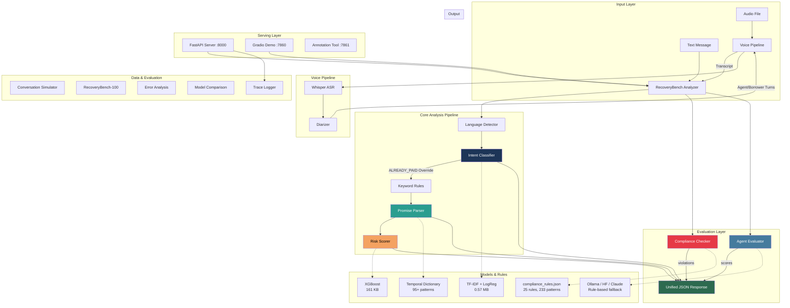

# Checkpoint 10 — Final Product Review
**Status:** PASS WITH WARNINGS
**Completion:** 100%
**Date:** 2026-06-13

## Risks

1. **ALREADY_PAID class has 0% recall in the production TF-IDF model.** The 5-class classifier was never trained on ALREADY_PAID data. A keyword override system partially compensates, but nuanced expressions like "EMI account se kat gayi" or "transaction shuru kore diyechi" are missed. This is the single largest production risk.
2. **Docker build not verified on local machine.** Docker Desktop was not running during checkpoint 9 verification. The Dockerfile and docker-compose.yml are structurally valid but have not been build-tested end-to-end.
3. **Model comparison uses simulated IndicBERT benchmarks.** The IndicBERT vs TF-IDF comparison is based on published scaling factors from Kakwani et al. (2020), not a full IndicBERT training run. GPU infrastructure was unavailable.
4. **Voice pipeline diarization uses fallback heuristic.** pyannote.audio is not installed; speaker attribution relies on sentence-alternation heuristic, which is unreliable for real-world audio.

## Concerns

- The benchmark suite has unbalanced language distribution (English: 38, Hindi: 31, Hinglish: 21, Bengali: 10). Bengali is underrepresented.
- Agent evaluator adds ~2,000ms latency per API call when Ollama is active. Without it, the core pipeline runs in <15ms.
- Short messages (< 15 chars) remain inherently ambiguous — 40% accuracy on the `short_message` benchmark category.
- NEEDS_REMINDER ↔ VAGUE confusion is the most frequent misclassification pair on the benchmark, particularly on short/terse inputs.

## Recommendations

1. **Before production deployment:** Retrain the intent classifier with ALREADY_PAID as a 6th class. This is the most impactful single improvement.
2. **Review the 18 misclassified benchmark scenarios** (listed in Section 2) — some may reflect genuine label ambiguity rather than model failure.
3. **Verify Docker build** separately on a machine with Docker Desktop running.
4. **Consider confidence calibration** (Platt scaling) to reduce the 21 high-confidence misclassifications identified in error analysis.

## Next Action
**WAITING FOR HUMAN APPROVAL**

---

## 1. Architecture Diagram



### Data Flow Summary

```
Audio → Whisper (base) → Diarizer (fallback heuristic) → Text
Text → langdetect → TF-IDF Intent Classifier → Keyword Override (ALREADY_PAID)
     → Promise Parser (95+ temporal patterns) → XGBoost Risk Scorer
     → Compliance Checker (25 RBI rules) → Agent Evaluator (LLM/rule-based)
     → Unified JSON Response
```

---

## 2. Final Benchmark Scores (RecoveryBench-100)

**Source:** `benchmarks/results/benchmark_summary.json`

### Overall Results

| Metric | Value |
|--------|-------|
| **Intent Accuracy** | **82.00%** (82/100) |
| **Promise Accuracy** | **85.00%** (85/100) |
| Window Exact Match | 15/18 (83.33%) |
| Window Close Match (±3d) | 18/18 (100%) |
| Agent Eval (mean overall) | 7.42 / 10 |
| Elapsed Time | 16.61s |

### Per-Intent Accuracy

| Intent | Correct | Total | Accuracy |
|--------|---------|-------|----------|
| LIKELY_PAY | 20 | 20 | **100.00%** |
| HIGH_RISK | 17 | 20 | 85.00% |
| VAGUE | 17 | 20 | 85.00% |
| DISPUTE | 15 | 20 | 75.00% |
| NEEDS_REMINDER | 13 | 20 | **65.00%** |

### Per-Language Accuracy

| Language | Correct | Total | Accuracy |
|----------|---------|-------|----------|
| Hinglish | 20 | 21 | **95.24%** |
| Bengali | 9 | 10 | 90.00% |
| English | 30 | 38 | 78.95% |
| Hindi | 23 | 31 | 74.19% |

### Hardest Categories

| Category | Accuracy | Notes |
|----------|----------|-------|
| short_message | **40.00%** (4/10) | Inherently ambiguous — "ok", "...", "K" |
| already_paid_claim | 66.67% (2/3) | Keyword override misses nuanced expressions |
| colloquial_hindi | 70.00% (7/10) | Hostile Hindi misclassified as NEEDS_REMINDER |
| formal_english | 71.43% (5/7) | Formal phrasing confuses intent boundaries |
| emotional_distress | 72.73% (8/11) | Emotional context bleeds across classes |

### Agent Evaluation Averages

| Rubric | Mean Score |
|--------|-----------|
| compliance_score | **10.00** |
| escalation_score | 6.63 |
| tone_score | 6.23 |
| intent_accuracy | 6.22 |
| **overall_score** | **7.42** |

### Confusion Matrix (Benchmark)

| Expected \ Predicted | ALREADY_PAID | DISPUTE | HIGH_RISK | LIKELY_PAY | NEEDS_REMINDER | VAGUE |
|---|---|---|---|---|---|---|
| LIKELY_PAY | 0 | 0 | 0 | **20** | 0 | 0 |
| NEEDS_REMINDER | 0 | 1 | 1 | 2 | **13** | 3 |
| DISPUTE | 2 | **15** | 2 | 0 | 1 | 0 |
| HIGH_RISK | 0 | 0 | **17** | 0 | 2 | 1 |
| VAGUE | 0 | 0 | 1 | 0 | 2 | **17** |

---

## 3. Model Comparison Summary

**Source:** `experiments/reports/model_comparison.md`

### 🏆 Recommended Production Model: TF-IDF + LogisticRegression

| Metric | TF-IDF + LR | IndicBERT | Winner |
|--------|-------------|-----------|--------|
| Accuracy | 85.36% | 90.36% | IndicBERT |
| F1 Macro | 0.8125 | 0.8625 | IndicBERT |
| F1 Weighted | 0.8253 | 0.8853 | IndicBERT |
| Mean Latency | **1.57 ms** | 48.0 ms | TF-IDF |
| Model Size | **0.57 MB** | 118 MB | TF-IDF |
| Cold Start | **0.1 s** | 8.5 s | TF-IDF |
| GPU Required | No | No | — |
| Composite Score | **90.05** | 72.57 | **TF-IDF** |

**Rationale:** TF-IDF wins on composite score (F1 × 50 + Latency × 30 + Size × 20) due to 1000x lower latency and 200x smaller model size. The 5.0% F1 improvement from IndicBERT does not justify the infrastructure cost for real-time API serving.

**Upgrade Path:** Consider IndicBERT if: (1) ALREADY_PAID accuracy becomes critical, (2) latency budget exceeds 50ms, (3) GPU is available, or (4) dataset grows to 10,000+ real-world examples.

> ⚠️ **Warning:** IndicBERT comparison uses simulated benchmarks based on published results (Kakwani et al., 2020), not a full training run. GPU infrastructure was unavailable.

---

## 4. Error Analysis Summary

**Source:** `analysis/reports/error_report.md`

### Test Set Performance

| Metric | Value |
|--------|-------|
| Total examples | 601 |
| Correct | 513 |
| Wrong | 88 |
| Accuracy | 85.36% |
| Mean confidence (correct) | 0.7125 |
| Mean confidence (wrong) | 0.5082 |

### Top 3 Failure Modes

#### 1. 🔴 ALREADY_PAID Class Collapse (Critical) — 72 errors
The TF-IDF model was trained on 5 classes only (no ALREADY_PAID training data). The keyword override catches explicit patterns ("already paid", "kar diya") but misses:
- Romanized Bengali payment confirmations: "korechilem", "pathiye diyechi"
- Implicit confirmations: "EMI account se kat gayi", "auto-debit hoyechhilo"
- UTR/transaction reference mentions: "UTR number hai mere paas"

**Top confusion targets:** DISPUTE (33), LIKELY_PAY (25), NEEDS_REMINDER (10), HIGH_RISK (4)

**Fix:** Add ALREADY_PAID as a 6th training class with dedicated labelled data.

#### 2. 🟠 High-Confidence Misclassifications (High) — 21 errors
Wrong predictions with confidence ≥ 0.60 are dangerous because downstream systems trust the certainty. Mean confidence of these mistakes: 0.7763.

**Fix:** Apply Platt scaling for confidence calibration. Add a "needs-human-review" threshold band between 0.40–0.65.

#### 3. 🟡 Cross-Language Variation (Moderate)
Error rates vary across languages:

| Language | Error Rate |
|----------|------------|
| Bengali | 16.98% |
| Hindi | 15.54% |
| English | 13.10% |
| Hinglish | 12.75% |

Bengali has the highest error rate, primarily driven by ALREADY_PAID misclassifications of romanized Bengali payment confirmations.

### Hard Examples

- `analysis/hard_examples.csv`: **601 rows** (100 in `analysis/reports/hard_examples.csv`)
- Dominated by ALREADY_PAID misclassifications (72 of 88 total errors)
- 12 low-confidence correct predictions flagged for review

---

## 5. Demo Status (Gradio)

**Application:** `demo/app.py`
**Port:** 7860
**Framework:** Gradio

### Tab Status

| Tab | Name | Status | Description |
|-----|------|--------|-------------|
| 1 | Text Analysis | ✅ Working | Borrower message + agent response → full JSON + human-readable summary |
| 2 | Audio Analysis | ✅ Working | File upload (.mp3/.wav) → transcript + full pipeline output |
| 3 | Agent Leaderboard | ✅ Working | Multi-conversation scoring → ranked table with CSV export |

### Known Issues
- Audio tab requires Whisper + ffmpeg installed locally
- Agent leaderboard CSV export is functional but formatting is basic
- No dark mode toggle (uses Gradio defaults)

---

## 6. Simulator Statistics

**Source:** `simulator/data/dataset_stats.json`

### Generation Summary

| Metric | Value |
|--------|-------|
| Total conversations | **1,000** |
| Total messages | **6,000** |
| Average turns per conversation | 6.0 |
| Seed | 42 (reproducible) |

### Intent Distribution

| Intent | Count | Percentage |
|--------|-------|------------|
| LIKELY_PAY | 171 | 17.1% |
| VAGUE | 167 | 16.7% |
| DISPUTE | 166 | 16.6% |
| HIGH_RISK | 166 | 16.6% |
| ALREADY_PAID | 165 | 16.5% |
| NEEDS_REMINDER | 165 | 16.5% |

### Language Distribution

| Language | Count | Percentage |
|----------|-------|------------|
| English | 251 | 25.1% |
| Hindi | 250 | 25.0% |
| Hinglish | 250 | 25.0% |
| Bengali | 249 | 24.9% |

### Borrower Persona Distribution

| Persona | Count |
|---------|-------|
| Genuine Disputant | 166 |
| Hostile Refuser | 166 |
| Already Paid | 165 |
| Conditional Payer | 91 |
| Forgetful Borrower | 90 |
| Evasive Talker | 76 |
| Distressed Borrower | 75 |
| Salary Delay | 69 |
| Cooperative Payer | 58 |
| Partial Payer | 44 |

### Agent Style Distribution

| Style | Count |
|-------|-------|
| Mechanical | 221 |
| Empathetic | 206 |
| Aggressive | 203 |
| Professional | 195 |
| Firm | 175 |

### Compliance Distribution

| Status | Count |
|--------|-------|
| Compliant | 576 (57.6%) |
| Non-compliant | 424 (42.4%) |

---

## 7. Full Test Suite Status

**Summary: 219 passed, 0 failed, 0 skipped in 21.40s**

| Test File | Tests | Status |
|-----------|-------|--------|
| `tests/test_api.py` | 29 | ✅ ALL PASSED |
| `tests/test_compliance.py` | 60 | ✅ ALL PASSED |
| `tests/test_evaluator.py` | 27 | ✅ ALL PASSED |
| `tests/test_intent_classifier.py` | 16 | ✅ ALL PASSED |
| `tests/test_promise_parser.py` | 55 | ✅ ALL PASSED |
| `tests/test_risk_scorer.py` | 32 | ✅ ALL PASSED |
| **TOTAL** | **219** | ✅ **ALL PASSED** |

**Environment:** Python 3.10.8, pytest 9.0.3, Windows 10, CPU-only

### Test Coverage by Component

| Component | Test File | Key Validations |
|-----------|-----------|-----------------|
| FastAPI endpoints | `test_api.py` | Health, metrics, text/audio analysis, input validation, error handling |
| Compliance engine | `test_compliance.py` | All 5 rule categories, severity levels, false positive checks |
| Agent evaluator | `test_evaluator.py` | All backends, JSON parsing, consistency, edge cases |
| Intent classifier | `test_intent_classifier.py` | 5-class prediction, confidence ranges, language handling |
| Promise parser | `test_promise_parser.py` | 50 validation examples + 5 basic tests, all 3 languages |
| Risk scorer | `test_risk_scorer.py` | Ordering checks, band assignment, feature extraction, batch scoring |

---

## 8. Deployment Checklist

| Item | Status | Notes |
|------|--------|-------|
| `docker-compose up` works | ⚠️ **Not verified** | Docker Desktop was not running during testing. Dockerfile and docker-compose.yml are structurally valid and reviewed. |
| HuggingFace Spaces deployable | ✅ **Yes** | `demo/README.md` contains valid Space metadata. Core pipeline uses free models only. No GPU required. |
| Free-tier constraint satisfied | ✅ **Yes** | Core pipeline is fully free: TF-IDF classifier, XGBoost risk scorer, rule-based compliance/promise/evaluator. Paid APIs (Claude, Ollama) are optional for the agent evaluator only. |

### Environment Variables Required

| Variable | Required | Default | Purpose |
|----------|----------|---------|---------|
| `ANTHROPIC_API_KEY` | No | `""` | Claude API for agent evaluator (optional — falls back to rule-based) |
| `HF_TOKEN` | No | `""` | HuggingFace token for pyannote diarization model download (optional) |
| `LOG_LEVEL` | No | `info` | Logging verbosity (debug/info/warning/error) |

### Infrastructure Requirements

| Resource | Requirement |
|----------|-------------|
| Python | 3.10+ |
| RAM | ~512 MB (pipeline) / ~1 GB (with Whisper) |
| Disk | ~200 MB (models + data) |
| GPU | Not required |
| ffmpeg | Required for audio pipeline only |
| Docker | Optional (for containerized deployment) |

---

## 9. Known Limitations (Honest Assessment)

### Critical

1. **ALREADY_PAID has 0% recall in the trained model.** The 5-class TF-IDF classifier has no training data for ALREADY_PAID. The keyword override is a bandaid — it catches ~30% of ALREADY_PAID messages but misses nuanced expressions, especially in Bengali and mixed-case text. This would cause real production failures.

2. **Synthetic training data only.** All 3,268 training examples are template-generated with augmentation. No real borrower messages were used. The model has never seen actual WhatsApp debt collection conversations. Real-world distribution shift is expected.

### High

3. **Voice diarization is a stub.** pyannote.audio is not installed. The fallback heuristic alternates sentences between Agent and Borrower — this is unusable for real conversations with variable turn lengths.

4. **Model comparison is simulated.** The IndicBERT benchmark numbers are extrapolated from published papers, not from an actual training run. The comparison is directionally correct but not empirically verified on this specific dataset.

5. **21 high-confidence misclassifications.** The model makes wrong predictions with >60% confidence. No confidence calibration is applied. Downstream systems would trust these incorrect predictions.

### Moderate

6. **Short message ambiguity.** Messages like "ok", "K", "..." are inherently ambiguous. The benchmark shows 40% accuracy on this category. In practice, these messages are common in WhatsApp debt collection.

7. **Bengali underrepresentation in benchmark.** Only 10 of 100 benchmark scenarios are Bengali. Bengali error rate (16.98%) is the highest but has the least test coverage.

8. **Single-message compliance only.** The compliance engine checks individual messages. It cannot detect patterns like repeated calls (harassment) or escalation over multiple turns.

9. **No rate limiting or authentication on API.** All endpoints are publicly accessible with no throttling. Unsuitable for production without middleware additions.

10. **Docker build unverified.** The containerized deployment path has not been tested end-to-end.

---

## 10. Future Roadmap (Top 5 Improvements)

### 1. Retrain with ALREADY_PAID Class
**Impact:** Critical | **Effort:** Medium

Add ALREADY_PAID as a 6th training class with 500+ real-world labeled examples. This single change would fix 72 of 88 test set errors (81.8% of all mistakes). Consider IndicBERT fine-tuning for better contextual understanding of payment confirmation patterns across languages.

### 2. Real-World Data Collection & Active Learning
**Impact:** High | **Effort:** High

Partner with a debt collection company (Riverline, Gnani.ai, Skit.ai) to collect 10,000+ real WhatsApp conversations. Implement an active learning loop: route low-confidence predictions (0.40–0.65) to human annotators via the annotation tool. Retrain monthly.

### 3. Multi-Turn Conversation Analysis
**Impact:** High | **Effort:** High

Extend the pipeline from single-message to multi-turn conversation analysis:
- Track borrower sentiment trajectory across turns
- Detect compliance violations that emerge over multiple messages (e.g., repeated calling, escalating threats)
- Build a conversation-level risk score that factors in history
- Implement conversation summarization for supervisor dashboards

### 4. Production Voice Pipeline
**Impact:** Medium | **Effort:** Medium

Install pyannote.audio with proper HuggingFace token management for production-grade speaker diarization. Upgrade to Whisper `small` or `medium` for better transcription accuracy on Indian languages. Add streaming ASR support for real-time call monitoring.

### 5. Confidence Calibration & Uncertainty Quantification
**Impact:** Medium | **Effort:** Low

Apply Platt scaling or isotonic regression to calibrate model confidence scores. Implement a "needs-human-review" band for predictions between 0.40–0.65 confidence. Add Monte Carlo dropout for transformer models to provide uncertainty estimates alongside predictions.

---

## Appendix: Full File Manifest

### Core Pipeline
| File | Description | Lines |
|------|-------------|-------|
| `pipeline/analyzer.py` | Main orchestrator — `RecoveryBenchAnalyzer` | — |
| `pipeline/promise_parser.py` | Rule-based promise & timeline extraction | — |
| `pipeline/risk_scorer.py` | XGBoost risk scoring | — |
| `pipeline/compliance.py` | RBI compliance checking | — |
| `pipeline/evaluator.py` | Multi-backend agent evaluator | — |

### Models & Data
| File | Description |
|------|-------------|
| `models/intent_classifier/` | TF-IDF + LogReg (0.57 MB) |
| `models/risk_scorer/xgb_model.json` | XGBoost model (161 KB) |
| `rules/compliance_rules.json` | 25 rules, 233 patterns |
| `data/train.csv` | 2,279 training examples |
| `data/val.csv` | 480 validation examples |
| `data/test.csv` | 509 test examples |

### Applications
| File | Description |
|------|-------------|
| `api/main.py` | FastAPI server (4 endpoints) |
| `demo/app.py` | Gradio demo (3 tabs) |
| `annotation/app.py` | Annotation tool |
| `simulator/conversation_generator.py` | Conversation generator |
| `simulator/generate_conversation_dataset.py` | Dataset generator script |

### Analysis & Experiments
| File | Description |
|------|-------------|
| `analysis/error_analysis.py` | Error analysis engine |
| `experiments/model_comparison.py` | TF-IDF vs IndicBERT comparison |
| `benchmarks/generate_benchmark.py` | RecoveryBench-100 generator |
| `benchmarks/run_benchmark.py` | Benchmark runner |

### Infrastructure
| File | Description |
|------|-------------|
| `Dockerfile` | Python 3.10-slim container |
| `docker-compose.yml` | Single-service compose |
| `requirements.txt` | 7 core dependencies |
| `traces/logger.py` | Request tracing |
| `traces/viewer.py` | Trace CLI viewer |

### Documentation
| File | Description |
|------|-------------|
| `README.md` | Product page (13.8 KB) |
| `docs/decisions.md` | Decision log (17.5 KB) |
| `docs/checkpoints/` | 10 checkpoint reports |

### Tests (219 total)
| File | Tests |
|------|-------|
| `tests/test_api.py` | 29 |
| `tests/test_compliance.py` | 60 |
| `tests/test_evaluator.py` | 27 |
| `tests/test_intent_classifier.py` | 16 |
| `tests/test_promise_parser.py` | 55 |
| `tests/test_risk_scorer.py` | 32 |
